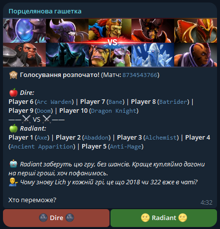
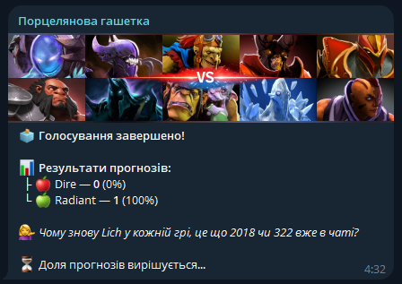
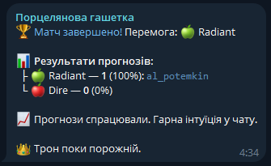
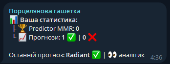

<div align="center">

# 🎲 Porcelain Shutter 🎲

**Telegram bot for predicting Dota 2 match outcomes**  
Pre-match voting, result summaries, Predictor MMR rating system, and a throne for the best forecaster in your chat.

[](https://openjdk.org/)
[](https://spring.io/projects/spring-boot)
[](https://www.postgresql.org/)
[](https://www.docker.com/)

</div>

---

## Screenshots

### 🗳 Voting

> After the character draft, before the zero-minute horn, the bot publishes team rosters and opens voting.
> Player can link their nickname before the game so that the bot will highlight the allied team.



---

### ⏳ Voting Closed

> After 1 minute, the buttons disappear and vote percentages are shown along with a meme comment. If someone voted
> against their own team, the bot calls it out.



---

### 🏆 Match Summary

> Once the match ends, the bot posts the result: who predicted correctly, MMR changes, and the current throne status.



---

### 📊 Statistics

> Personal stat card and the full chat leaderboard with Predictor MMR, 322 stats, and win/loss streaks.



---

## Features

### 🗳 Voting

- The bot receives team rosters via REST API and publishes a vote in the group chat
- Buttons: **🌝 Radiant 🌝** / **🌚 Dire 🌚** — a registered player's own team is highlighted with `🦔` emoji
- Voting closes automatically after 1 minute — percentages and a meme comment are posted
- If a registered player voted against their own team — `💸 322 detected in chat...` appears in the message
- After the match ends, the bot posts a detailed summary with per-player breakdowns

### 👑 Predictor MMR & Throne System

All players start at **0 MMR**. MMR changes only apply when **3 or more** players voted in a match.

| Event                        | Change               |
|------------------------------|----------------------|
| Correct prediction           | **+25 MMR**          |
| Wrong prediction             | **−15 MMR**          |
| Throne captured / battle won | **+15 MMR** (bounty) |
| Minimum value                | **0 MMR**            |

**Throne states:**

| State                      | Condition                                                  |
|----------------------------|------------------------------------------------------------|
| 👑 Throne is empty         | No player has reached 100 MMR yet                          |
| 👑 Supreme Forecaster      | Single leader with the highest MMR ≥ 100                   |
| ⚔️ Battle for the throne   | Multiple players tied at the top MMR                       |
| 👑 Throne changes hands    | New leader dethroned the previous one — +15 bounty awarded |
| ⚔️ Player can dethrone him | Player is within 25 MMR of the current leader              |

### 💸 322 Detector

If a player has a registered Dota 2 nickname, the bot automatically detects which team they play on. Voting **against
your own team** counts as 322. This is tracked separately in player statistics.

### 📊 Statistics Commands

| Command                | Description                                                               |
|------------------------|---------------------------------------------------------------------------|
| `/statistic`           | Your personal stat card: MMR, predictions, 322 history, streak, last vote |
| `/statistic @username` | Stat card for another player                                              |
| `/statistic_all`       | Full chat leaderboard sorted by Predictor MMR                             |

### 🎮 Dota 2 Profile

| Command                | Description                                   |
|------------------------|-----------------------------------------------|
| `/register NickName`   | Register a Dota 2 nickname (multiple allowed) |
| `/unregister NickName` | Remove a specific nickname                    |
| `/profile`             | List all your registered nicknames            |

---

## REST API

The bot is controlled via HTTP requests from an external service (e.g. a match data parser).

### `POST /api/vote/start` — start a vote

```json
{
  "matchId": "8192837465",
  "predictionComment": "Radiant has a better late game on this patch",
  "memeComment": "Choose wisely or suffer 😤",
  "teams": [
    {
      "teamSide": "Radiant",
      "players": [
        {
          "nickname": "Player0",
          "character": "Axe"
        },
        {
          "nickname": "Player1",
          "character": "Crystal Maiden"
        }
      ]
    },
    {
      "teamSide": "Dire",
      "players": [
        {
          "nickname": "Player5",
          "character": "Arc Warden"
        }
      ]
    }
  ]
}
```

### `POST /api/vote/summarize` — submit the match result

```json
{
  "matchId": "8192837465",
  "teamWon": "Radiant"
}
```

---

## Getting Started

### Prerequisites

- Docker & Docker Compose
- A Telegram Bot Token (get one from [@BotFather](https://t.me/BotFather))
- PostgreSQL (or use the bundled Docker Compose setup)

### 1. Clone the repository

```bash
git clone https://github.com/al-potemkin/porcelain-shutter-telegram-bot.git
cd porcelain-shutter-telegram-bot
```

### 2. Create a `.env` file

```env
BOT_USERNAME=your_bot_username
BOT_TOKEN=your_telegram_bot_token

DB_NAME=d2tdb
DB_USER=postgres
DB_PASSWORD=postgres

# Debug mode — send all messages to a single chat only
BOT_DEBUG_ENABLED=false
BOT_DEBUG_CHAT_ID=321123321

D2C_SERVICE_ENABLE=false
# URL of the external collage service (optional). It is possible to additionally launch a service that generates a banner for a survey with characters from the current match. Link to the service at the end.
D2C_SERVICE_URL=localhost:8081
```

### 3. Start the bot

```bash
docker-compose up --build
```

The bot will be available on port `8080`. PostgreSQL runs on `5432`.

---

## Configuration

| Variable             | Default    | Description                                                          |
|----------------------|------------|----------------------------------------------------------------------|
| `BOT_USERNAME`       | —          | Bot username without `@` (**required**)                              |
| `BOT_TOKEN`          | —          | Telegram Bot API token (**required**)                                |
| `DB_NAME`            | `d2tdb`    | JDBC database URL                                                    |
| `DB_USER`            | `postgres` | Database user                                                        |
| `DB_PASSWORD`        | `postgres` | Database password                                                    |
| `BOT_DEBUG_ENABLED`  | `false`    | Debug mode — all messages go to selected chat where is the bot added |
| `BOT_DEBUG_CHAT_ID`  | —          | Target chat ID for debug mode (**optional**)                         |
| `D2C_SERVICE_ENABLE` | `false`    | Enabling the use of a third-party service for generating collages    |
| `D2C_SERVICE_URL`    | —          | URL where the collage service is located (**optional**)              |

`telegram.bot.vote-duration-minutes` in `application.properties` controls how long voting stays open — default is **1
minute**.

---

## Database

The schema is managed automatically via `spring.jpa.hibernate.ddl-auto=update`.

### Tables

| Table              | Purpose                                                             |
|--------------------|---------------------------------------------------------------------|
| `votes`            | User votes per match                                                |
| `poll_sessions`    | Voting session lifecycle: `ACTIVE` → `VOTING_CLOSED` → `SUMMARIZED` |
| `user_statistics`  | Cumulative stats: MMR, streaks, betrayal counts                     |
| `registered_chats` | Chats where the bot is active                                       |
| `dota_profiles`    | Telegram user → Dota 2 nickname mappings                            |

---

## Architecture

```
src/main/java/com/porcelain_shutter/bot/
│
├── config/
│   ├── BotCommands.java           # Bot command constants
│   ├── BotRegistrationConfig.java # Bot registration in Spring context
│   └── KeyboardFactory.java       # Inline keyboards (with player team highlighting)
│
├── controller/
│   └── VoteController.java        # POST /api/vote/start | summarize
│
├── dto/
│   ├── MatchEndRequest.java
│   ├── MatchStartRequest.java
│   ├── RegisterResult.java
│   ├── Team.java
│   ├── ThroneEvent.java           # Throne state enum
│   ├── ThroneGame.java            # Match outcome + throne state
│   ├── VoteResult.java
│   └── VoterStat.java
│
├── entity/
│   ├── DotaProfile.java
│   ├── MatchStatus.java
│   ├── PollSession.java
│   ├── RegisteredChat.java
│   ├── UserStatistic.java
│   ├── Vote.java
│   └── VoteType.java
│
├── feign/
│   ├── mapper/
│   │   └── FeignMapper.java
│   ├── request/
│   │   └── CollageRequest.java
│   └── ImageProcessorFeign.java   # Feign client for collage service
│
├── handler/
│   ├── BotMessages.java           # All message texts and formatting
│   └── MatchVotingBot.java        # Core: long polling, commands, callbacks, scheduler
│
├── repository/
│   ├── DotaProfileRepository.java
│   ├── PollSessionRepository.java
│   ├── RegisteredChatRepository.java
│   ├── UserStatisticRepository.java
│   └── VoteRepository.java
│
├── service/
│   ├── BannerProcessingService.java  # Match banner image processing
│   ├── DotaProfileService.java       # Dota 2 nickname management
│   ├── LocaleService.java            # Localization support
│   ├── ObjectMapperConverter.java    # JSON serialization helpers
│   ├── PollService.java              # Session lifecycle management
│   ├── RegisteredChatService.java    # Auto-registration of group chats
│   ├── StatisticService.java         # MMR, betrayal detection, streaks, throne logic
│   └── VoteService.java              # Vote persistence, race condition protection
│
├── utils/
│   └── MessageFormattingUtility.java
│
└── TelegramBotApplication.java
```

---

## Tech Stack

|                      | Technology                      |
|----------------------|---------------------------------|
| **Runtime**          | Java 21                         |
| **Framework**        | Spring Boot 3.2                 |
| **Database**         | PostgreSQL 16                   |
| **Telegram SDK**     | TelegramBots 9.x (Long Polling) |
| **Containerization** | Docker + Docker Compose         |

---

## Related

| Project                                                                                         | Description                                                                            |
|-------------------------------------------------------------------------------------------------|----------------------------------------------------------------------------------------|
| [dota2-collage-of-confrontation](https://github.com/al-potemkin/dota2-collage-of-confrontation) | Companion service that generates match banner images sent alongside the voting message |

---

<div align="center">
  Made with ☕ and too much Dota 2
</div>